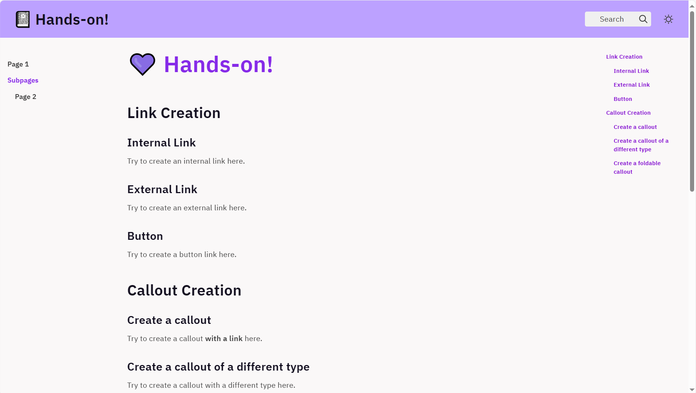
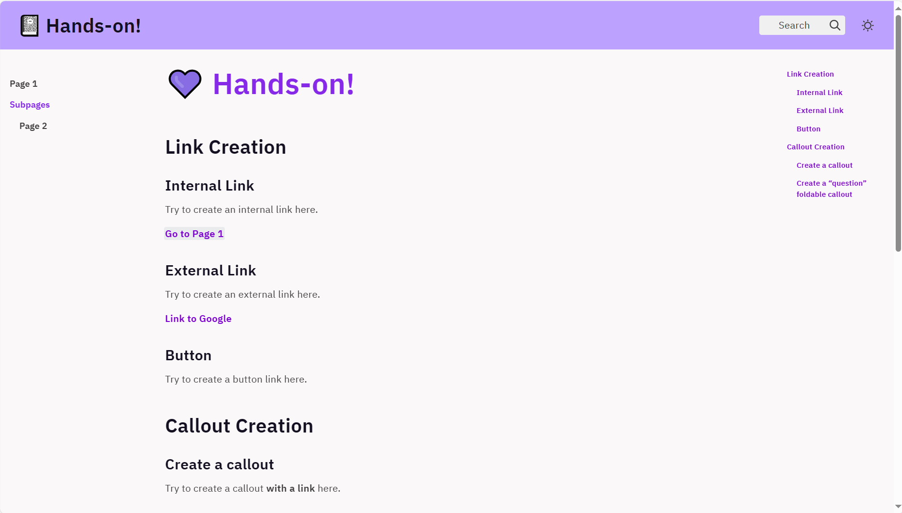
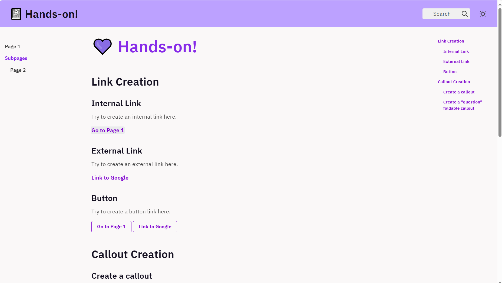
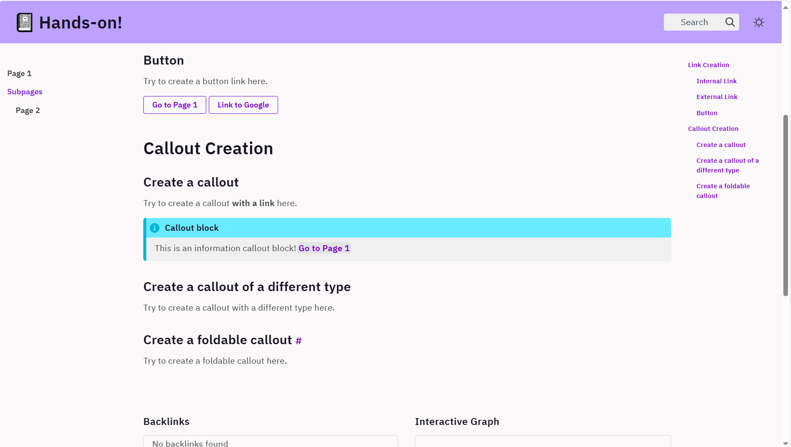
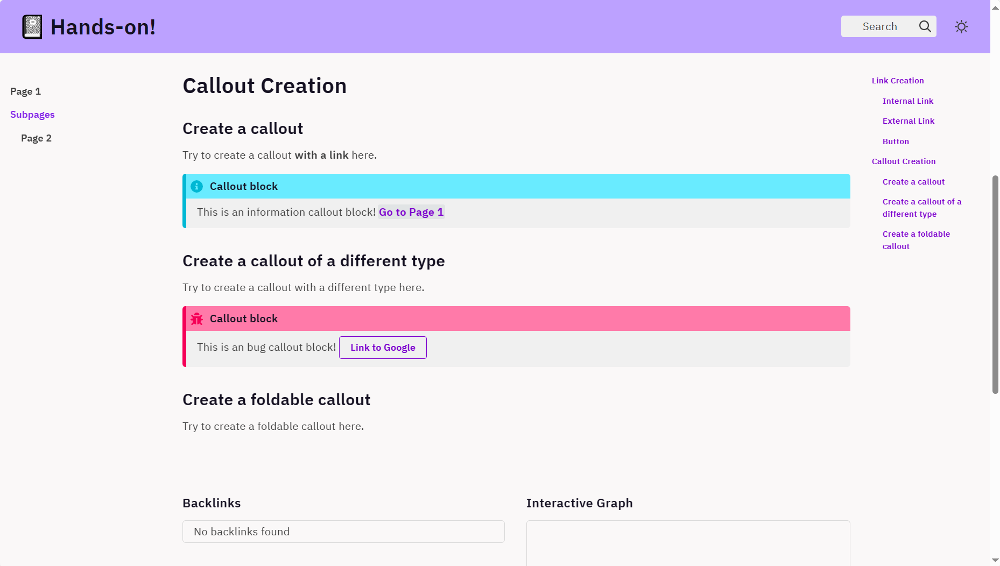
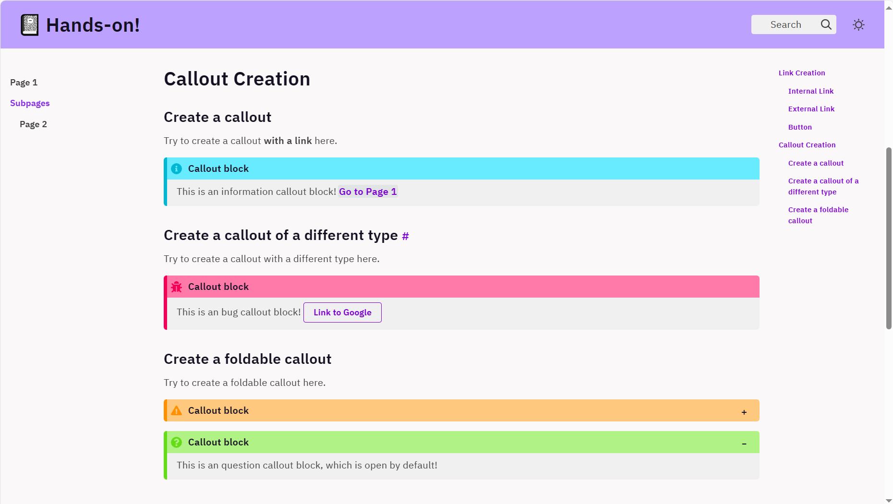
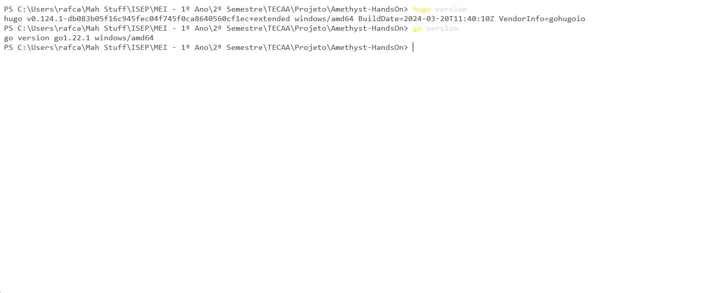

# 1. Introduction

Hyperlinks (usually shortened as _Links_) are essential tools that connect to different pages of your website or other websites entirely, allowing users to better navigate the internet. 

This hands-on will show you how to create different styles of links in the Amethyst theme for Hugo. It is a short formative hands-on, and can be taken in 16 minutes. 

Take your time and have fun exploring it at your own pace.

_(If you encounter any problem while executing some commands, check out the Troubleshooting section at the end of this document)_

# 2. Hands-on

A base Amethyst website is already prepared for you to use. 

Navigate to the [base repository](https://github.com/Three-Strikes/Amethyst-HandsOn) and clone it, or open a terminal and run the following command:

```
git clone https://github.com/Three-Strikes/Amethyst-HandsOn.git
```

After cloning, run the project using:
```
hugo serve
```

**Perfect!** 

Check the state of the initial website at [http://localhost:1313/](http://localhost:1313/).




* The main page is ready for you to add all code you will learn in this hands-on.
* The pages on the left menu (Page 1 and Page 2) will be used as targets for the links you create.

**Important:** To edit this main page while following the hands-on, you just need to edit the '_index.md' file present in the 'content' directory.


## 2.1 Simple Links

### 2.1.1 Internal links

Internal links are used to navigate between different pages within your static website. Follow these steps to establish a reference to another webpage:

**Identify the Target Page:** Determine the page within your website that you want to link to. Note its relative URL or path.

**Choose Link Text:** Decide on the text that will serve as the clickable link. This is the text that users will see and click on to navigate to the target page.

**Add the Link:**

```
# Creating an Internal link
[Go to Page 1](/page1)
```

_The text inside **[ ]** is what will be displayed on the page, and inside **( )** goes the relative URL or path of the target page._

**Nice job!** 

After saving your changes, you should see your link working on the main page. 

_**Extra:** Can you figure out how to create a link to Page 2? (remember, it's inside a folder)_


### 2.1.2 External links

Links to external pages allow users to navigate to websites outside of your own. Follow these steps to add links to external pages:

**Identify the Target External Page:** Determine the URL of the external page you want to link to. This could be any webpage on the internet.

**Choose Link Text:** Decide on the text that will serve as the clickable link. This is the text that users will see and click on to navigate to the external page.

**Add the External Link:**

```
# External web page link
[Link to Google](https://www.google.pt)
```

**Good!** 

After saving your changes, you should see your external link working on the main page. 


### 2.1.3 Simple links example

If everything went well, you should now have a website similar to this.



_If this is not the result you got, don't hesitate to ask for help!_

## 2.2 Link Buttons

Link Buttons are a variation of links that are effective for guiding user actions and can be styled to stand out on your website. Follow these steps to create buttons that link to other web pages:

**Identify the Target Page:** Determine whether the target page is internal (within your website) or external (outside your website).

**Choose Button Text:** Decide on the text that will appear on the button. This text should clearly indicate the action the button performs.

**Add the Button Code:**

```
## Internal Link Button
Go to Page 1

## External Link Button
Link to Google
```
_Notice how the fields are very similar to the simple links: one for the display text, and one for the link itself._

**That's it!** 

After saving your changes, you should see your link buttons working on the main page.



# 3. Callouts

Callouts in Amethyst are a way of displaying important information to the user that is related to a section of the content on the main page, wihout breaking the main flow of the page.

_They are a good place to put important links!_

## 3.1 Creating a Callout

To create a callout, you can follow these steps.

**Identify the need for a callout -** Where is a callout appropriate to use, and what will you place inside this callout?

The syntax you need to create a callout is as such:

```
> [!info] Callout block
>
> This is an information callout block!
> [Go to Page 1](/page1)
```

_As you can see, you can insert any markdown content inside the callout, including links, and even buttons!_

**Awesome!** 

After saving your changes, you should see your first callout working on the main page.



_**Note:** If you want to add a space between the text and the link, you need an empty line with just ">" between them._


## 3.2 Callouts with Types

Did you know? Amethyst supports 12 types of callouts!

You should pick the appropriate type for the information you want to give to the user, as this will give them a hint at its contents right away. 

The different types of callouts that amethyst supports are:

* [!examples] - used to show examples;
* [!notes] - used to keep relevant notes close to the content;
* [!summaries] - useful for summaries;
* [!info] - useful for general information;
* [!hint] - useful to give hints about a problem the reader is trying to solve;
* [!success] - used to highlight the success of a message;
* [!question] - useful to ask questions;
* [!warning] - useful to warn the reader of something can can influence the page's content;
* [!failure] - useful to warn the user of a failure;
* [!error] - used to bring attention to an error;
* [!bug] - used to bring attention to a bug;
* [!quote] - used for quotes and referencing;


**Add a callout with a different type:**
```
> [!bug] Callout block
>
> This is an bug callout block!
> Link to Google
```
_You can experiment with all of them, to see their differences!_

**Nice!** 

After saving your changes, you should see your new type of callout working on the main page.



## 3.3 Foldable Callouts

With a very small modification, you can create a foldable callout!

Placing a "-" after the square brackets of the callout type will make it folded (closed) by default, while placing a "+" will make it unfolded (open) by default.

**Add foldable callouts:**
```
> [!warning]- Callout block
>
> This is an warning callout block, which is closed by default!

> [!question]+ Callout block
>
> This is an question callout block, which is open by default!
```

**Well done!** 

After saving your changes, you should see your foldable callouts working on the main page.



# 3. Conclusion

With this, you have reached the end of this hands-on! We hope you had an easy and fun time learning some different ways of adding links and their variations to a website made with the Amethyst theme for Hugo.

Until next time!

# 4. Troubleshooting

## 4.1 Hugo and Go

You should check if you have the pre requesites required to run the project.

You do so by running the following commands in the terminal.

```
hugo version

go version
```

If both of these commands return the version numbers of the programs in question, like in the image bellow, you're good to go.



If not, you must install them to proceed. Follow the next steps to get up and running.

### 4.1.1 Installing Go

To install go, you must go to the folllowing [website](https://go.dev/doc/install) and click on the Download button. Or alternatively, install go through your system's package manager:

```
brew install go //if on macOS

choco install go //if on Windows
```

Then go through the installer for your system. Be aware that, if you're on windows, and the system cannot recognize the "go" command after installing, try restarting your system.

### 4.1.2 Installing Hugo

To install Hugo, you need the [chocolatey package manager](https://chocolatey.org/install#individual). On Mac OS, you can use [brew](https://brew.sh/) instead.

To install the package manager on windows,

Then after installing a package manager, simply run:

```
brew install hugo //if on macOS

choco install hugo-extended //if on Windows
```

### 4.1.3 Other Common Issues 
While setting up and running your Hugo website project, you may encounter some common issues. Below are troubleshooting steps and resolutions for these problems:

- **Error: Command 'hugo serve' not recognized:**
  Troubleshoot: Review Hugo installation process and ensure it's added to system PATH.
  Resolution: Reinstall Hugo if needed, ensuring correct installation steps are followed.
- **Error: Unable to start Hugo server:**
  Troubleshoot: Check for port conflicts or specific error messages in terminal output.
  Resolution: Stop conflicting processes, change server port if necessary, or seek online solutions.
- **Error: Hugo site not rendering as expected:**
  Troubleshoot: Check terminal for build errors, review project files for misconfigurations.
  Resolution: Fix errors in files, refer to theme documentation if applicable, seek online help if needed.